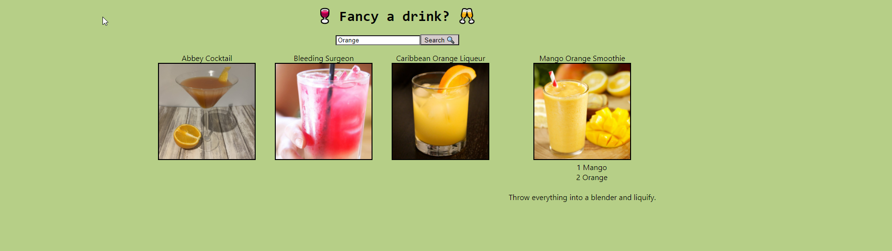

# Cocktail generator

This app generates a list of cocktails based on searched ingredients and then provides the user with the recipe upon clicking on the image.

## Screenshots



## Installation

Install my-project with npm

```bash
  npm install
  npm start
```

## Appendix

This project uses React.

## Deployment

To deploy this project run

```bash
  npm run build
```

## FAQ

#### How many cocktails can I view

This app generates up to 10 cocktails, depending on your search.

## 🚀 About Me

I'm training as a full stack developer on the School of Code bootcamp.

## Support

For support, email roberthuwjones@outlook.com
